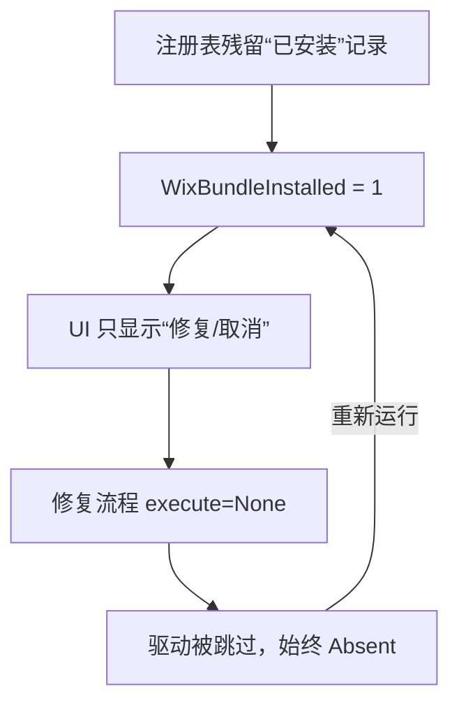

# Intel Wi-Fi 驱动安装失败修复（AX210 / 24.60.0.3）

一个针对 **Intel Wi-Fi 驱动安装包"只显示修复、无安装选项"** 问题的诊断说明与一键修复脚本。

- 🎯 问题本质：WiX Burn 捆绑包处于"半装"状态，安装器误判为已安装
- 🛠️ 修复方式：清除"假已安装"注册残留，让安装器重新进入安装流程
- 🔒 安全设计：清理前展示来源、自动备份、交互确认

---

## 目录

- [问题现象](#问题现象)
- [原理](#原理)
- [快速开始](#快速开始)
- [脚本参数](#脚本参数)
- [输出示例](#输出示例)
- [常见问题](#常见问题)
- [免责声明](#免责声明)

---

## 问题现象

运行 Intel Wi-Fi 驱动安装包（如 `WiFi-24.60.0-Driver64-Win10-Win11.exe`）时：

1. 安装器窗口**只有"修复"和"取消"**，没有"安装"选项；
2. 点"修复"提示成功，但网卡仍是**未知设备（网络控制器）**，驱动从未真正装上；
3. 反复重试无效，形成"好像装上了、其实没反应"的死循环。

---

## 原理

### 安装包结构

Intel 的 `WirelessSetup.exe` 由 **WiX Burn** 引擎打包，内含 4 个组件：

| 组件 ID | 类型 | 作用 |
|---------|------|------|
| `NetFx48Redist` | ExePackage | .NET Framework 运行时依赖 |
| `Pre_Install` | — | 将 INF 注入系统驱动库（DriverStore） |
| `WIFI_Driver` | InfPackage | **驱动本体**，负责绑定到网卡设备 |
| `DocsManager` | MsiPackage | Intel 文档管理器 |

真正让网卡"活过来"的是 `WIFI_Driver` 这一步。

### 两个根因

**根因 1：半装残留，导致"假已安装"**

Burn 引擎通过注册表卸载项判断自身是否已安装：

```
HKLM\SOFTWARE\Microsoft\Windows\CurrentVersion\Uninstall\{ProductCode}
```

当"外壳已注册、驱动组件却缺席"时，日志会同时出现：

```
DetectComplete(): PackageId = WIFI_Driver | State = Absent   ← 驱动没装上
Variable: WixBundleInstalled = 1                             ← 却判定"已安装"
```

于是 UI 只给"修复"。

**根因 2：permanent 组件在修复模式不会重装**

驱动包被标记为 permanent（永久）。修复计划里它被直接跳过：

```
Planned package: WIFI_Driver, state: Absent,
    default requested: Repair,
    execute: None           ← 不执行
```

所以"修复"永远修不好驱动，两个根因构成死循环：



**破解点**：删除残留注册记录，让引擎重新进入 Install 分支。

---

## 快速开始

### 前置条件

- Windows 10 / 11（本案例为 Windows 11）
- 已下载好 Intel Wi-Fi 驱动安装包
- 以**管理员身份**运行脚本（脚本会自动尝试提权）

### 步骤

```powershell
# 1. 预览：查看待删项及其来源（不做任何修改）
.\Resolve-IntelWifiBundle.ps1

# 2. 执行：展示来源 → 交互确认 → 备份并删除残留
.\Resolve-IntelWifiBundle.ps1 -Execute -KillProcess

# 3. 重新运行驱动安装包（界面应出现“安装”）
#    之后用下方命令验证网卡驱动
```

```powershell
# 验证 AX210 网卡是否已绑定驱动
Get-CimInstance Win32_PnPSignedDriver |
    Where-Object { $_.DeviceID -match 'VEN_8086&DEV_2725' } |
    Select-Object DeviceName, DriverVersion, DriverDate
```

期望输出：

```
DeviceName    : Intel(R) Wi-Fi 6E AX210 160MHz
DriverVersion : 24.60.0.3
```

---

## 脚本参数

| 参数 | 说明 | 默认值 |
|------|------|--------|
| `-BundleGuid` | 指定单个 Bundle 的 ProductCode，如 `{83F975D5-1545-4ADC-A0DB-3159079448E7}` | 自动扫描 |
| `-NameFilter` | 按卸载项显示名筛选（正则） | `Intel.*(Wi\|Wireless\|Software Installer\|WiFi)` |
| `-LogPath` | 指定安装日志路径；留空自动读取最新主日志 | 自动 |
| `-Execute` | 真正执行删除；不加则仅预览 | 关闭 |
| `-KillProcess` | 同时结束卡死的 `WirelessSetup.exe` 进程 | 关闭 |
| `-Force` | 跳过删除前的交互确认 | 关闭 |
| `-BackupDir` | 注册表备份目录 | `%TEMP%\bundle-reg-backup` |

### 常用组合

```powershell
# 只针对某个 GUID，执行并跳过询问
.\Resolve-IntelWifiBundle.ps1 -BundleGuid '{83F975D5-1545-4ADC-A0DB-3159079448E7}' -Execute -Force

# 指定某份日志执行
.\Resolve-IntelWifiBundle.ps1 -LogPath "$env:TEMP\Intel®_Software_Installer_20260907043950.log" -Execute
```

---

## 输出示例

```
发现 2 条注册表位置，涉及 1 个捆绑包：
  - [Intel® Software Installer]  GUID={83F975D5-1545-4ADC-A0DB-3159079448E7}

待删项来源参考：
  ◆ 注册表项: HKLM:\SOFTWARE\Microsoft\Windows\CurrentVersion\Uninstall\{83F975D5-...}
  ◆ 注册表项: HKLM:\SOFTWARE\Classes\Installer\Dependencies\{83F975D5-...}
    来源[ProviderKey] 文件: C:\Users\...\Temp\Intel®_Software_Installer_20260907043950.log
        原文: i410: Variable: WixBundleProviderKey = {83F975D5-1545-4ADC-A0DB-3159079448E7}

即将删除上述 2 条注册表项
确认执行？输入 y 继续，其它任意键取消
```

每个待删项都会列出其**来源参考**（日志文件 + 锚点类型 + 原始行），核对无误后再输入 `y` 确认。

---

## 常见问题

**Q1：为什么安装器只显示"修复"？**

因为注册表里有残留卸载项，Burn 引擎判定 `WixBundleInstalled = 1`。删除该键即可恢复"安装"选项。

**Q2：删除注册表安全吗？**

脚本删除前会：
1. 展示每个待删项及其日志来源，供核对；
2. 用 `reg export` 备份为 `.reg` 文件（位于 `%TEMP%\bundle-reg-backup\`）；
3. 执行前再次交互确认。

**Q3：ProductCode（GUID）是怎么确定的？**

优先从安装日志的以下锚点提取，再与注册表扫描结果交叉验证：

- `WixBundleProviderKey = {GUID}`
- `registration key: ...Uninstall\{GUID}`
- `Registering bundle dependency provider: {GUID}`

**Q4：脚本会误删蓝牙等其它驱动吗？**

不会。脚本只针对卸载项中 `UninstallString` 含 `WirelessSetup.exe` 的 Burn 捆绑包，并只处理形如 `{GUID}` 的 ProductCode，不涉及驱动库（DriverStore）。

**Q5：清理完还要做什么？**

重新以管理员身份运行驱动安装包，界面出现"安装"后走完流程；建议最后重启一次，并确认网卡显示为 `Intel(R) Wi-Fi 6E AX210 160MHz`。

---

## 免责声明

本工具会修改注册表，请**务必先运行预览模式核对**待删项与来源。注册表项删除后如需还原，可双击备份目录下的 `.reg` 文件导入。操作前请确认已备份重要数据。

---

## License

MIT