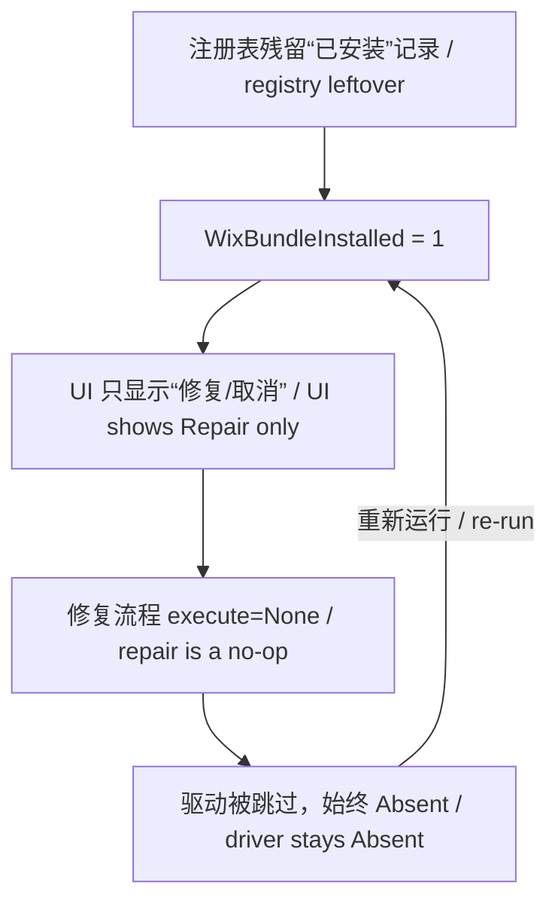

# Intel Wi-Fi 驱动安装失败修复（AX210 / 24.60.0.3）

# Intel Wi-Fi Driver Install Failure Fix (AX210 / 24.60.0.3)

针对 Intel Wi-Fi 驱动安装包"只显示修复、无安装选项"问题的诊断说明与一键修复脚本。
A diagnosis guide and one-click fix script for Intel Wi-Fi driver installers that only show "Repair" and never "Install".

- 🎯 问题本质 / Root cause：WiX Burn 捆绑包处于"半装"状态，安装器误判为已安装 / The WiX Burn bundle is half-installed and misdetected as installed
- 🛠️ 修复方式 / Fix：清除"假已安装"注册残留，让安装器重新进入安装流程 / Remove phantom install registry entries so the installer re-enters the install flow
- 🔒 安全设计 / Safety：清理前展示来源、自动备份、交互确认 / Show evidence before removal, auto-backup, interactive confirmation

---

## 目录 / Table of Contents

- [问题现象 / Symptoms](#问题现象--symptoms)
- [原理 / How it works](#原理--how-it-works)
- [快速开始 / Quick start](#快速开始--quick-start)
- [脚本参数 / Parameters](#脚本参数--parameters)
- [输出示例 / Sample output](#输出示例--sample-output)
- [常见问题 / FAQ](#常见问题--faq)
- [免责声明 / Disclaimer](#免责声明--disclaimer)

---

## 问题现象 / Symptoms

运行 Intel Wi-Fi 驱动安装包（如 `WiFi-24.60.0-Driver64-Win10-Win11.exe`）时：
When running an Intel Wi-Fi driver package (e.g. `WiFi-24.60.0-Driver64-Win10-Win11.exe`):

1. 安装器窗口**只有"修复"和"取消"**，没有"安装"选项；
   The installer window only shows **"Repair" and "Cancel"**, with no "Install" option.
2. 点"修复"提示成功，但网卡仍是**未知设备（网络控制器）**，驱动从未真正装上；
   "Repair" reports success, yet the NIC remains an unknown device, and the driver is never actually installed.
3. 反复重试无效，形成"好像装上了、其实没反应"的死循环。
   Retrying does not help, creating an endless loop of "appears installed, actually nothing works".

---

## 原理 / How it works

### 安装包结构 / Bundle structure

Intel 的 `WirelessSetup.exe` 由 **WiX Burn** 引擎打包，内含 4 个组件：
Intel's `WirelessSetup.exe` is packaged with the **WiX Burn** engine and contains 4 packages:

| 组件 ID / Package ID | 类型 / Type | 作用 / Purpose |
|---------|------|------|
| `NetFx48Redist` | ExePackage | .NET Framework 运行时依赖 / .NET runtime dependency |
| `Pre_Install` | — | 将 INF 注入系统驱动库（DriverStore） / Stage INF into DriverStore |
| `WIFI_Driver` | InfPackage | **驱动本体**，负责绑定到网卡设备 / The driver itself, binds to the NIC |
| `DocsManager` | MsiPackage | Intel 文档管理器 / Intel documentation manager |

真正让网卡"活过来"的是 `WIFI_Driver` 这一步。
What makes the NIC actually work is the `WIFI_Driver` package.

### 两个根因 / Two root causes

**根因 1 / Cause 1：半装残留，导致"假已安装" / Half-installed leftovers cause "fake installed"**

Burn 引擎通过注册表卸载项判断自身是否已安装：
The Burn engine decides whether it is installed by looking at its registry uninstall entry:

```
HKLM\SOFTWARE\Microsoft\Windows\CurrentVersion\Uninstall\{ProductCode}
```

当"外壳已注册、驱动组件却缺席"时，日志会同时出现：
When the bundle is registered but the driver package is missing, the log shows both:

```
DetectComplete(): PackageId = WIFI_Driver | State = Absent   ← 驱动没装上 / driver not installed
Variable: WixBundleInstalled = 1                             ← 却判定"已安装" / yet treated as installed
```

于是 UI 只给"修复"。
As a result the UI only offers "Repair".

**根因 2 / Cause 2：permanent 组件在修复模式不会重装 / permanent packages are not reinstalled in Repair mode**

驱动包被标记为 permanent（永久）。修复计划里它被直接跳过：
The driver package is marked permanent, so the repair plan skips it entirely:

```
Planned package: WIFI_Driver, state: Absent,
    default requested: Repair,
    execute: None           ← 不执行 / no-op
```

所以"修复"永远修不好驱动，两个根因构成死循环：
Thus "Repair" can never fix the driver; the two causes form a dead loop:



**破解点 / Breaking point**：删除残留注册记录，让引擎重新进入 Install 分支。
Delete the leftover registry entries so the engine re-enters the Install branch.

---

## 快速开始 / Quick start

### 前置条件 / Prerequisites

- Windows 10 / 11（本案例为 Windows 11） / Windows 10 / 11 (this case: Windows 11)
- 已下载好 Intel Wi-Fi 驱动安装包 / Intel Wi-Fi driver package downloaded
- 以**管理员身份**运行脚本（脚本会自动尝试提权）/ Run the script as administrator (it self-elevates)

### 步骤 / Steps

```powershell
# 1. 预览：查看待删项及其来源（不做任何修改）
#    Preview: show items and their evidence (no changes)
.\Resolve-IntelWifiBundle.ps1

# 2. 执行：展示来源 → 交互确认 → 备份并删除残留
#    Execute: show evidence -> confirm -> backup and remove
.\Resolve-IntelWifiBundle.ps1 -Execute -KillProcess

# 3. 重新运行驱动安装包（界面应出现“安装”）
#    Re-run the driver installer (it should now show "Install")
#    之后用下方命令验证网卡驱动 / then verify the NIC driver with:
```

```powershell
# 验证 AX210 网卡是否已绑定驱动 / verify AX210 driver binding
Get-CimInstance Win32_PnPSignedDriver |
    Where-Object { $_.DeviceID -match 'VEN_8086&DEV_2725' } |
    Select-Object DeviceName, DriverVersion, DriverDate
```

期望输出 / Expected output:

```
DeviceName    : Intel(R) Wi-Fi 6E AX210 160MHz
DriverVersion : 24.60.0.3
```

---

## 脚本参数 / Parameters

| 参数 / Parameter | 说明 / Description | 默认值 / Default |
|-------|------|--------|
| `-BundleGuid` | 指定单个 Bundle 的 ProductCode / Specify a single bundle ProductCode | 自动扫描 / auto-detect |
| `-NameFilter` | 按卸载项显示名筛选（正则）/ Filter by display name (regex) | `Intel.*(Wi\|Wireless\|Software Installer\|WiFi)` |
| `-LogPath` | 指定安装日志路径；留空自动读取最新主日志 / Log path; blank auto-picks latest non-elevated log | 自动 / auto |
| `-Execute` | 真正执行删除；不加则仅预览 / Actually delete; omit for preview only | 关闭 / off |
| `-KillProcess` | 同时结束卡死的 `WirelessSetup.exe` 进程 / Also kill stuck WirelessSetup.exe | 关闭 / off |
| `-Force` | 跳过删除前的交互确认 / Skip interactive confirmation | 关闭 / off |
| `-BackupDir` | 注册表备份目录 / Registry backup directory | `%TEMP%\bundle-reg-backup` |

### 常用组合 / Common usages

```powershell
# 只针对某个 GUID，执行并跳过询问 / target one GUID, no prompt
.\Resolve-IntelWifiBundle.ps1 -BundleGuid '{83F975D5-1545-4ADC-A0DB-3159079448E7}' -Execute -Force

# 指定某份日志执行 / use a specific log
.\Resolve-IntelWifiBundle.ps1 -LogPath "$env:TEMP\Intel®_Software_Installer_20260907043950.log" -Execute
```

---

## 输出示例 / Sample output

```
发现 2 条注册表位置，涉及 1 个捆绑包：
Found 2 registry locations for 1 bundle:
  - [Intel® Software Installer]  GUID={83F975D5-1545-4ADC-A0DB-3159079448E7}

待删项来源参考：
Evidence of items to remove:
  ◆ 注册表项: HKLM:\SOFTWARE\Microsoft\Windows\CurrentVersion\Uninstall\{83F975D5-...}
  ◆ 注册表项: HKLM:\SOFTWARE\Classes\Installer\Dependencies\{83F975D5-...}
    来源[ProviderKey] 文件: C:\Users\...\Temp\Intel®_Software_Installer_20260907043950.log
        原文: i410: Variable: WixBundleProviderKey = {83F975D5-1545-4ADC-A0DB-3159079448E7}

即将删除上述 2 条注册表项
About to remove the 2 entries above
确认执行？输入 y 继续，其它任意键取消
Confirm? Enter y to proceed, any other key to cancel
```

每个待删项都会列出其**来源参考**（日志文件 + 锚点类型 + 原始行），核对无误后再输入 `y` 确认。
Every item lists its evidence (log file + anchor type + raw line); press `y` only after verifying.

---

## 常见问题 / FAQ

**Q1：为什么安装器只显示"修复"？ / Why does the installer only show "Repair"?**

因为注册表里有残留卸载项，Burn 引擎判定 `WixBundleInstalled = 1`。删除该键即可恢复"安装"选项。
Because a leftover uninstall key makes the engine set `WixBundleInstalled = 1`. Removing it restores the "Install" option.

**Q2：删除注册表安全吗？ / Is registry removal safe?**

脚本删除前会 / Before removal the script will:
1. 展示每个待删项及其日志来源，供核对 / show each item and its log evidence for review;
2. 用 `reg export` 备份为 `.reg` 文件（位于 `%TEMP%\bundle-reg-backup\`）/ back up as `.reg` files under `%TEMP%\bundle-reg-backup\`;
3. 执行前再次交互确认 / prompt for confirmation before acting.

**Q3：ProductCode（GUID）是怎么确定的？ / How is the ProductCode (GUID) determined?**

优先从安装日志的以下锚点提取，再与注册表扫描结果交叉验证：
First extracted from these log anchors, then cross-checked against the registry scan:

- `WixBundleProviderKey = {GUID}`
- `registration key: ...Uninstall\{GUID}`
- `Registering bundle dependency provider: {GUID}`

**Q4：脚本会误删蓝牙等其它驱动吗？ / Can it wrongly remove Bluetooth or other drivers?**

不会。脚本只针对卸载项中 `UninstallString` 含 `WirelessSetup.exe` 的 Burn 捆绑包，并只处理形如 `{GUID}` 的 ProductCode，不涉及驱动库（DriverStore）。
No. It only targets Burn bundles whose `UninstallString` contains `WirelessSetup.exe`, handles only `{GUID}` ProductCodes, and never touches the DriverStore.

**Q5：清理完还要做什么？ / What to do after cleanup?**

重新以管理员身份运行驱动安装包，界面出现"安装"后走完流程；建议最后重启一次，并确认网卡显示为 `Intel(R) Wi-Fi 6E AX210 160MHz`。
Re-run the driver installer as admin and complete the "Install" flow; finally reboot and confirm the NIC shows `Intel(R) Wi-Fi 6E AX210 160MHz`.

---

## 免责声明 / Disclaimer

本工具会修改注册表，请**务必先运行预览模式核对**待删项与来源。注册表项删除后如需还原，可双击备份目录下的 `.reg` 文件导入。操作前请确认已备份重要数据。

This tool modifies the registry. **Always run preview mode first** to review the items and their evidence. To roll back, double-click the `.reg` files in the backup directory. Back up important data before proceeding.

---

## License

MIT
